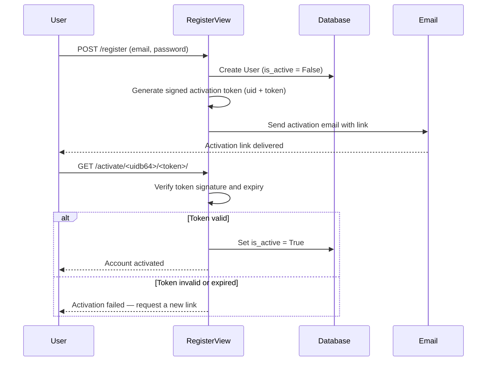
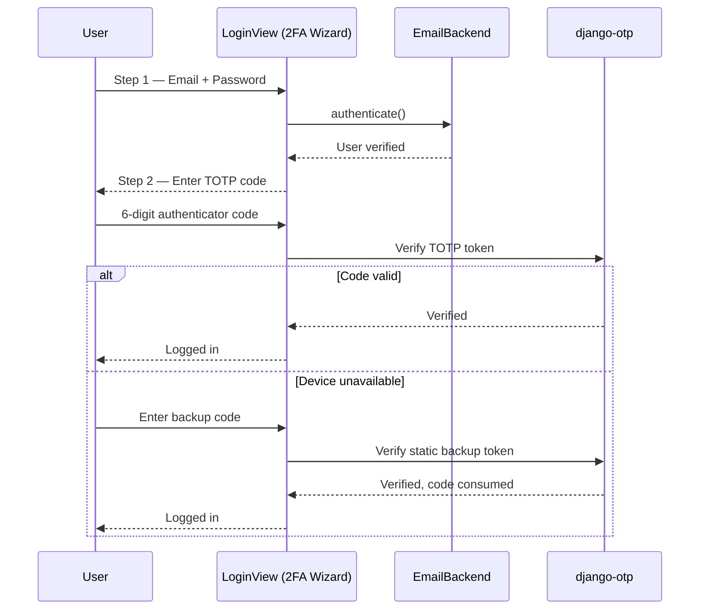

<div align="center">

# AuthForge — Advanced Authentication in Django

### A from-first-principles authentication system: email-based identity, signed-token account activation, and TOTP two-factor login with backup codes.

[](https://www.djangoproject.com/)
[](https://www.python.org/)
[](https://github.com/jazzband/django-two-factor-auth)
[](#security-hardening-checklist)

**[Overview](#overview) · [Core Features](#core-features) · [Routes](#routes) · [Authentication Flows](#authentication-flows) · [Security Architecture](#security-architecture) · [Getting Started](#getting-started) · [Hardening Checklist](#security-hardening-checklist)**

</div>

<br>

## Overview

AuthForge is a Django authentication system built directly on Django's own primitives rather than a single all-in-one identity package: a custom email-based authentication backend, signed-token account activation, and a multi-step two-factor login wizard combining TOTP authenticator codes with backup recovery codes.

The `AuthForge` project hosts configuration; the `core_auth` app contains the authentication logic itself — a custom user model, a custom authentication backend, registration and activation views, and a 2FA-aware login flow built on `django-otp` and `django-two-factor-auth`.

**What's implemented:**
- Email as the login identity, via a custom authentication backend
- Signed, time-limited account activation links
- TOTP-based two-factor authentication with QR code enrollment
- Backup/recovery codes for lost-device recovery
- Django's built-in password reset and change flows
- Rate-limit-aware login handling with a dedicated 429 response

---

## Core Features

| Feature | Status | Implementation |
|---|:---:|---|
| Email-based login (not username) | ✅ | Custom `EmailBackend` |
| Custom user model | ✅ | `AUTH_USER_MODEL = 'core_auth.User'` |
| Token-gated account activation | ✅ | Signed token + email link |
| TOTP two-factor authentication | ✅ | `django-otp` + `django-two-factor-auth` |
| Backup/recovery codes | ✅ | `otp_static` plugin |
| Password reset via email | ✅ | Django's built-in class-based views |
| Rate-limit-aware login handling | ⚠️ Partially wired | 429 handling exists; enabling decorators are commented out — see [checklist](#security-hardening-checklist) |
| Password strength validation | ❌ Currently disabled | See [checklist](#security-hardening-checklist) |
| SMS-based 2FA | 🔧 Installed, not wired | `two_factor.plugins.phonenumber` present, no active SMS backend |
| Email-based OTP | 🔧 Installed, not wired | `otp_email` plugin present, not yet used as an active method |

---

## Routes

All routes below live under the `core_auth` namespace (`core_auth:<name>`), defined in `core_auth/urls.py`. The 2FA-specific login/setup views are provided separately by `django-two-factor-auth` under its own `two_factor` namespace.

| Path | Name | View |
|---|---|---|
| `/login/` | `login` | Custom 2FA-wizard `LoginView` |
| `/logout/` | `logout` | Django's `LogoutView` |
| `/register/` | `register` | `RegisterView` |
| `/activate/<uidb64>/<token>/` | `activate` | `ActivateAccountView` |
| `/password-change/` | `password_change` | Django's `PasswordChangeView` |
| `/password-change/done/` | `password_change_done` | Django's `PasswordChangeDoneView` |
| `/password-reset/` | `password_reset` | Django's `PasswordResetView` |
| `/password-reset/done/` | `password_reset_done` | Django's `PasswordResetDoneView` |
| `/reset/<uidb64>/<token>/` | `password_reset_confirm` | Django's `PasswordResetConfirmView` |
| `/reset/done/` | `password_reset_complete` | Django's `PasswordResetCompleteView` |

---

## Authentication Flows

### Registration & Email Activation

Accounts are created inactive and gated behind a signed, time-limited activation link — the same signing mechanism Django's built-in password reset uses, applied here to onboarding.



### Login & Two-Factor Authentication

Login runs as a form wizard: credentials first, then a TOTP code, with backup codes as the fallback when the authenticator device isn't available.



---

## Security Architecture

**Identity resolution.** Authentication runs through `core_auth.backends.EmailBackend`, listed ahead of the default `ModelBackend` in `AUTHENTICATION_BACKENDS`. This changes how Django resolves identity without touching the rest of the auth framework — sessions, permissions, and `login_required` all continue to work exactly as Django expects.

**Activation tokens.** Account activation uses a token generator derived from `PasswordResetTokenGenerator`, combined with a base64-encoded user ID. The token is never stored in the database — it's derived cryptographically from the user's current state (password hash, last login), so it invalidates itself automatically the moment that state changes, without needing an expiry table or a cleanup job.

**Two-factor login.** The login view layers a credential check (`EmailAuthenticationForm`), a TOTP check (`AuthenticationTokenForm`), and a backup-code fallback (`BackupTokenForm`) via `django-two-factor-auth`'s wizard pattern. `django_otp.middleware.OTPMiddleware` tracks OTP verification state per-request, the same way Django tracks authentication state.

**Rate limiting.** The login view's `dispatch()` explicitly catches `django_ratelimit.exceptions.Ratelimited` and returns a dedicated `429` response, rather than letting a rate-limited request fail ambiguously. The decorators that trigger this path are currently disabled — see the checklist below.

---

## Tech Stack

| Layer | Technology |
|---|---|
| Framework | Django 5.2 |
| Two-Factor Auth | `django-two-factor-auth`, `django-otp` (TOTP + static backup codes) |
| Rate Limiting | `django-ratelimit` |
| Multi-step Forms | `django-formtools` (powers the 2FA login wizard) |
| Phone Number Handling | `django-phonenumber-field`, `phonenumbers` |
| QR Code Generation | `qrcode`, `pypng` (TOTP authenticator enrollment) |
| Configuration | `django-environ` (`.env`-based settings) |
| Templates | Django Templates + `django-widget-tweaks` |

---

## Getting Started

### Prerequisites

- Python 3.11+
- An email provider for production (the console backend is used in development)

### Installation

```bash
git clone git@github.com:AhmadHussainRandhawa/django-authforge.git
cd django-authforge

python -m venv venv
source venv/bin/activate    # On Windows: venv\Scripts\activate

pip install -r requirements.txt
```

### Environment configuration

Settings load via `django-environ` from a `.env` file at the project root. Create one:

```bash
SECRET_KEY=replace-with-a-real-generated-secret-key
DEBUG=True
ALLOWED_HOSTS=127.0.0.1,localhost
DATABASE_URL=sqlite:///db.sqlite3
```

Generate a real `SECRET_KEY` rather than relying on the development fallback:

```bash
python -c "from django.core.management.utils import get_random_secret_key; print(get_random_secret_key())"
```

### Migrate and run

```bash
python manage.py migrate
python manage.py createsuperuser
python manage.py runserver
```

### Walk through the flows

1. Visit `/register/` — creates an inactive account and sends an activation email (printed to the console in development)
2. Copy the activation link from the console output and visit it — the account becomes active
3. Log in — you'll be walked through the credential step, then TOTP setup (a QR code is generated for an authenticator app), then issued backup codes to store safely

---

## Project Structure

```
django-authforge/
│
├── AuthForge/            # Project config — settings, root urls, wsgi/asgi
│   └── settings.py       # Environment-driven config, 2FA + OTP app wiring
│
├── core_auth/            # The authentication app
│   ├── backends.py       # Custom EmailBackend
│   ├── views.py          # RegisterView, ActivateAccountView, 2FA-wizard LoginView
│   ├── urls.py           # Auth routes (login, register, activate, password reset)
│   └── forms.py          # Registration and authentication forms
│
├── templates/            # Templates, including two_factor/ overrides
└── requirements.txt
```

---

## Security Hardening Checklist
 
The state of this repo right now, tracked openly rather than glossed over:
 
- [ ] **Restore password validators.** `AUTH_PASSWORD_VALIDATORS` is assigned twice in `settings.py`; the second assignment (`= []`) overrides the first and disables all password strength checks. Remove the second assignment.
- [ ] **Enable rate limiting on login.** The `@ratelimit(...)` decorators on `LoginView` are currently commented out. The 429-handling code path exists but nothing triggers it yet — uncomment both decorators.
- [ ] **Configure a real email backend for production.** `EMAIL_BACKEND` is set to Django's console backend. Point it at a real provider before deploying.
- [ ] **Confirm `ALLOWED_HOSTS` and `SECRET_KEY` are set via environment** in any real deployment, not left at development defaults.
- [ ] **Decide on SMS and email OTP.** Both plugins are installed but not wired to a delivery method — either finish the integration or remove the unused plugins.
---
 
## Roadmap
 
- [ ] Finish SMS-based 2FA via the installed `phonenumber` plugin
- [ ] Finish email-based OTP as an alternative second factor
- [ ] Automated tests for registration, activation, and 2FA login — especially token expiry and rate-limit edge cases
- [ ] Account lockout policy after repeated failed 2FA attempts
- [ ] Audit logging for authentication events (login, failed 2FA, backup code use)
- [ ] A `LICENSE` file — not yet present in this repo; MIT is the likely choice once added
---
 
## Contributing
 
Contributions are welcome, particularly toward the items in the [Security Hardening Checklist](#security-hardening-checklist) and [Roadmap](#roadmap) above — both are pre-approved in direction, so you can go straight to a PR.
 
**Found a security issue?** Do not open a public issue — see [CONTRIBUTING.md](CONTRIBUTING.md#reporting-a-security-issue) for private disclosure instructions first.
 
For everything else — branching conventions, commit format, testing expectations, and the PR process — see [CONTRIBUTING.md](CONTRIBUTING.md).
 
---
 
## Contact
 
**Ahmad Hussain Randhawa**
 
- Email: official.ahmadrandhawa@gmail.com
- LinkedIn: [ahmad-hussain-randhawa](https://www.linkedin.com/in/ahmad-hussain-randhawa/)
- GitHub: [@AhmadHussainRandhawa](https://github.com/AhmadHussainRandhawa)
If you find a security issue beyond what's listed in the hardening checklist, please open an issue describing it.
